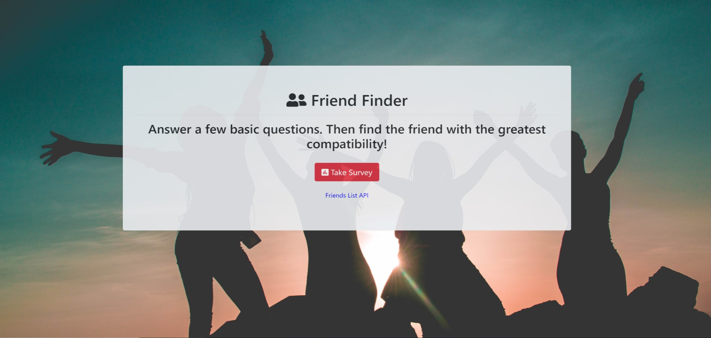
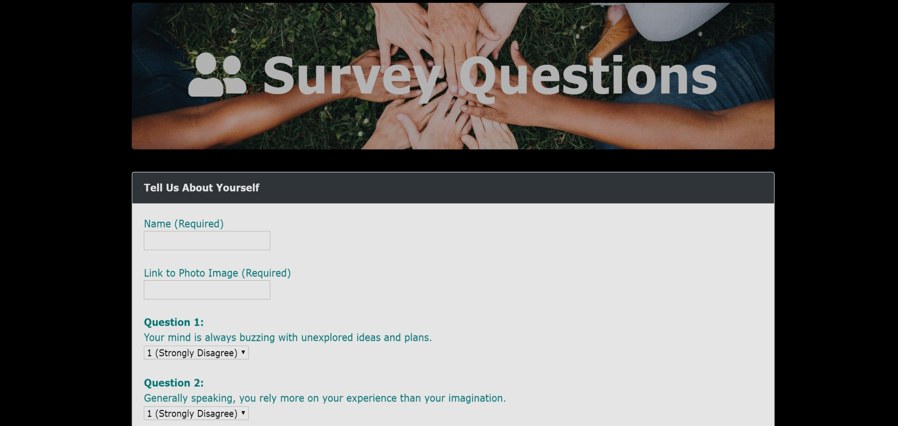

# FriendFinderApp
A Friend Finder App, a full-stack Express application that matches users based on the results of a personality quiz.

### Technologies Used: 
Node.js, Express, Bootstrap, Vanilla Javascript, DOM Manipulation 

This is a full-stack site will take in results from your users' surveys, then compare their answers with those from other users. The app will then display the name and picture of the user with the best overall match.

### See Live Demo: https://rocky-spire-26772.herokuapp.com/

## Some ScreenShots
 

